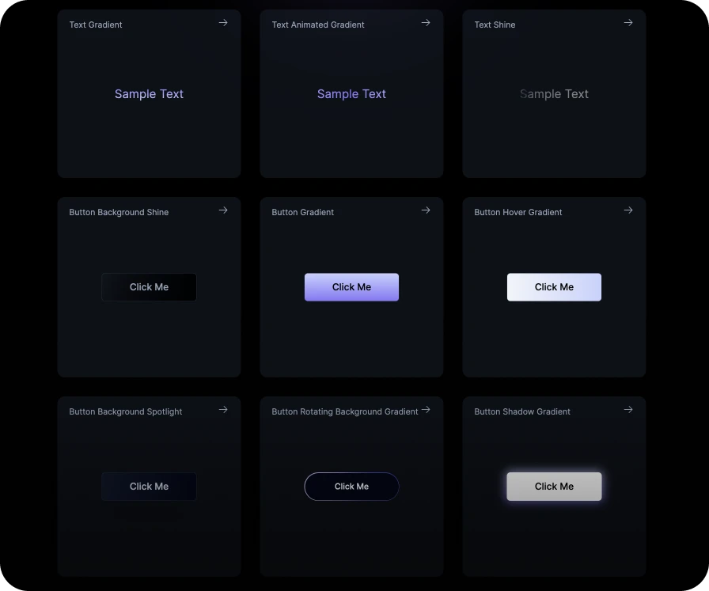

 

# UI.ibelick

Welcome to UI.ibelick, a collection of dark mode components and effects crafted with React and Tailwind CSS. This repository is a companion to my [blog](https://www.julienthibeaut.xyz/blog), where I write about various topics around design, front-end development, and more.

## How to Use

All components in this collection are designed to be easily integrated into your projects. Simply click on a component, copy the code, and paste it into your project.

## Inspiration

The components in this collection are inspired by various websites that have caught my eye, including: [Linear](https://linear.app/), [Liveblocks](https://liveblocks.io/), [Raycast](https://www.raycast.com/), [Vercel](https://vercel.com/), and more.

I'd also like to give a shout out to [UI Snippets](https://ui-snippets.dev/) and [Alexandru's Snippets](https://snippets.alexandru.so/) for inspiring me to build this showcase.

## Future Plans

While UI.ibelick is not perfect, it's a growing collection that I'm excited to develop further. If it gains traction, I plan to regularly update it and add more components. Your feedback and support can help shape its future, so stay tuned for more!
